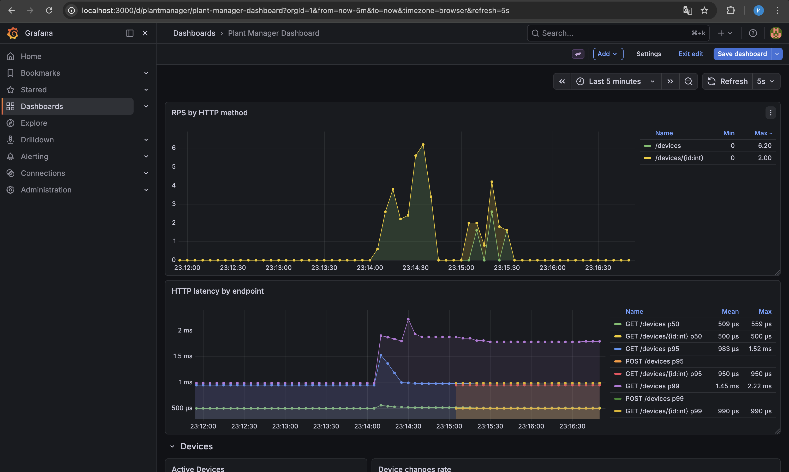
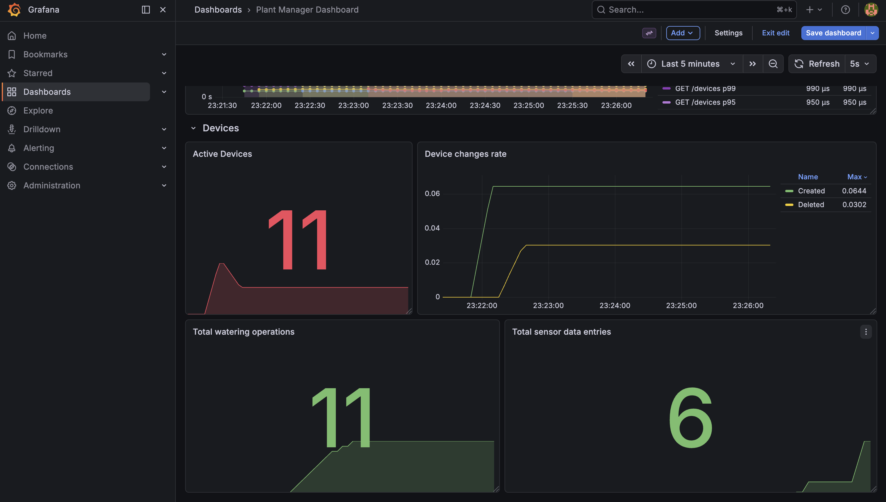

## Л/Р 3. Метрики и мониторинг

Приложение собирает метрики при помощи **Prometheus** и визуализирует их в **Grafana**.

### Собираемые метрики

#### Продуктовые метрики

| Метрика | Тип | Описание |
|---------|-----|----------|
| `plantmanager_watering_duration_seconds` | Histogram | Время полива в секундах. Buckets: 1, 2, 4, 8, 16, 32, 64, 128, 256, 512 |
| `plantmanager_watering_operations_total` | Counter | Общее количество операций полива (с label `device_id`) |
| `plantmanager_devices_created_total` | Counter | Общее количество созданных устройств |
| `plantmanager_devices_deleted_total` | Counter | Общее количество удалённых устройств |
| `plantmanager_sensor_data_entries_total` | Counter | Общее количество записей данных с датчиков (с label `device_id`) |

#### Инфраструктурные метрики (prometheus-net)

| Метрика | Тип | Описание |
|---------|-----|----------|
| `http_requests_total` | Counter | Всего HTTP запросов (labels: `method`, `endpoint`, `status`) |
| `http_request_duration_seconds` | Histogram | Длительность HTTP запросов (labels: `method`, `endpoint`) |

### Дашборд Grafana

Запросы


Продуктовые


### Примеры запросов в Prometheus

```promql
# Количество операций полива
plantmanager_watering_operations_total

# Активные устройства
plantmanager_devices_created_total - plantmanager_devices_deleted_total

# Запросов в секунду по методам
sum by (method) (irate(http_requests_total[30s]))
```