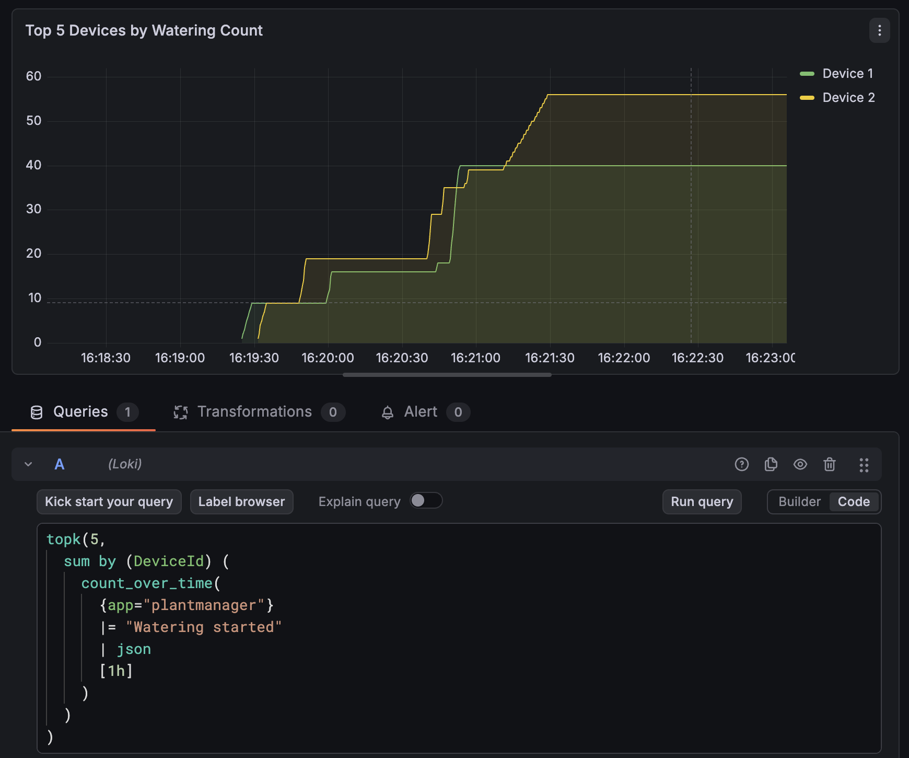
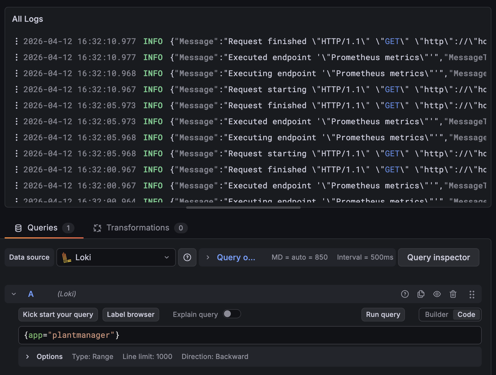
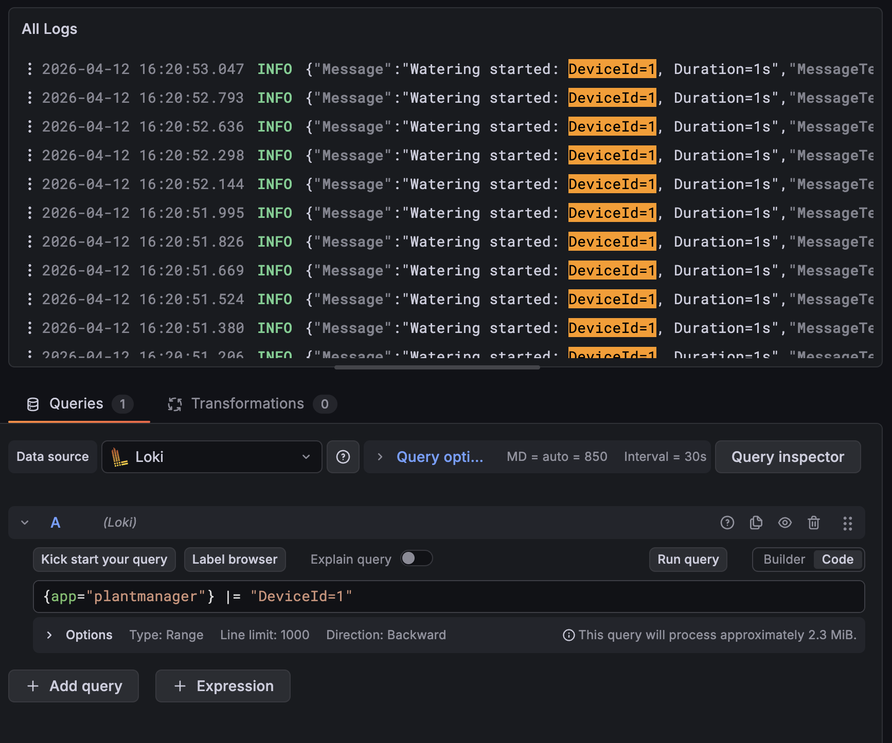
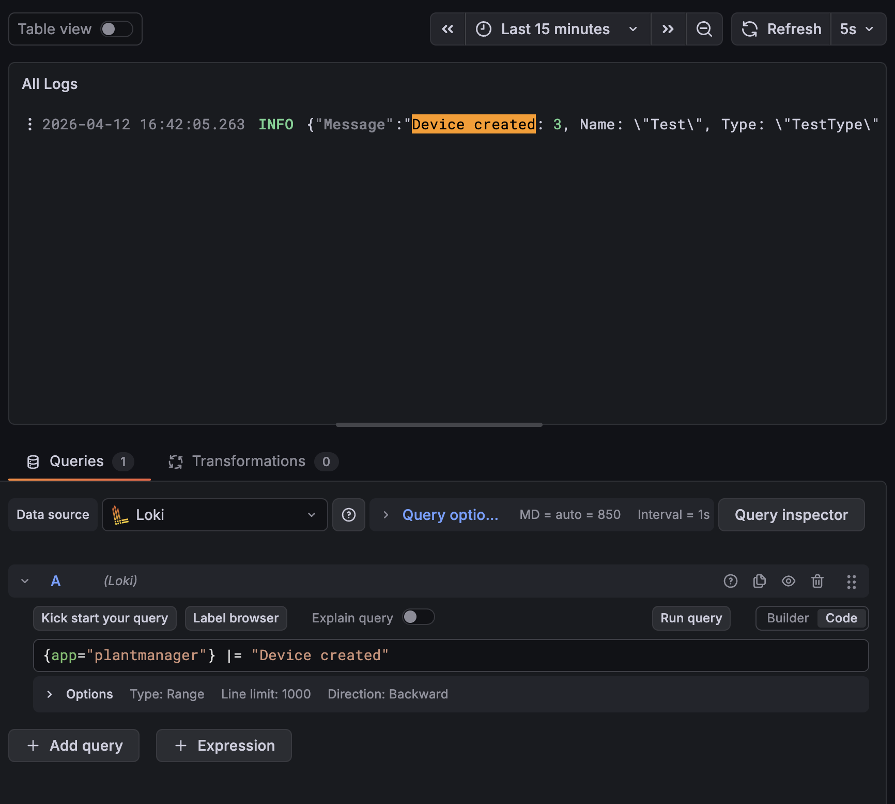

## Л/Р 4. Экспорт логов

Приложение собирает логи при помощи **Serilog** → **Loki** (напрямую через GrafanaLoki sink) и визуализирует их в **Grafana**.

### Архитектура логирования

```
PlantManager (C# package Serilog.Sinks.Grafana.Loki)
    ↓
Loki (хранение логов)
    ↓
Grafana (визуализация + запросы)
```

### Labels

Логи отправляются с labels:
- `app=plantmanager`
- `service=plantmanager`
- `level` (info, warning, error)
- `Environment` (Development, Production)

### События

| Событие | Уровень | Описание |
|---------|---------|----------|
| Создание устройства | Information | `Device created: {DeviceId}, Name: {Name}, Type: {Type}` |
| Удаление устройства | Information | `Device deleted: {DeviceId}` |
| Запуск полива | Information | `Watering started: DeviceId={DeviceId}, Duration={Duration}s` |
| Данные с датчика | Debug | `Sensor data received: DeviceId={DeviceId}, Temperature={Temperature}, Humidity={Humidity}` |

### Примеры запросов в Loki (LogQL) через Grafana

Топ 5 устройств по количеству поливов


Все логи


Поиск логов по конкретному устройтву


Поиск логов по конкретному событию
