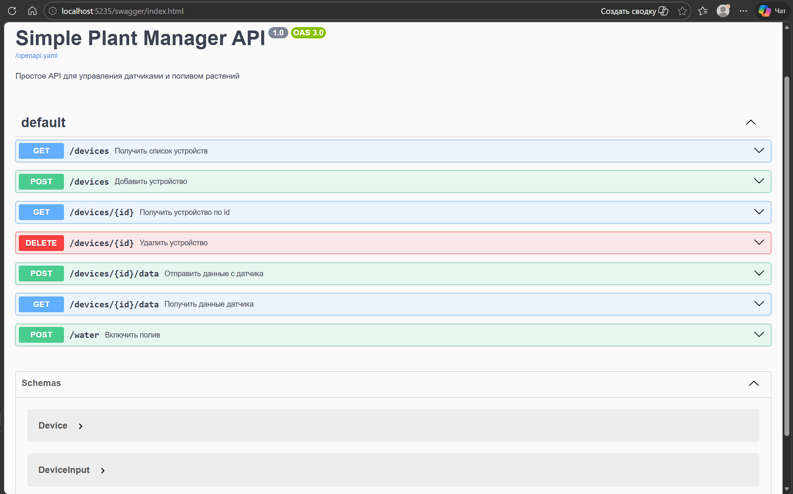

# Plant Manager API (API First с OpenAPI)

REST API для управления умной мини-теплицей (IoT Plant Manager), выполненный по подходу **API First** с использованием спецификации **OpenAPI 3.0**.

## О проекте

**Plant Manager API** — сервис для агрегации данных сенсоров и управления поливом растений в умной теплице. Позволяет регистрировать IoT-устройства (датчики), отправлять телеметрию (температура, влажность, влажность почвы) и дистанционно запускать полив с указанием продолжительности.

## Описание работы (API First)

Выполнено по методологии **API First**:

1. **Контракт API** — в корне проекта описан `openapi.yaml`: эндпоинты (`/devices`, `/devices/{id}`, `/devices/{id}/data`, `/water`), методы, схемы `Device`, `DeviceInput`, `SensorData`. Спецификация служит единым источником правды для клиента и сервера.
2. **Реализация сервера** — на основе контракта реализовано .NET 9 Minimal API приложение в папке `PlantManager/`. Единственный файл `Program.cs` содержит все маршруты и модели.
3. **In-memory хранилище** — устройства и телеметрия хранятся в памяти с использованием `ConcurrentDictionary` и `ConcurrentBag` для потокобезопасного доступа.
4. **Документация и тестирование** — тот же файл `openapi.yaml` раздаётся статически по адресу `/openapi.yaml`, а **Swagger UI** (`/swagger`) использует его напрямую для отображения интерактивной документации.

В итоге один файл OpenAPI задаёт и форму запросов/ответов, и интерактивную документацию.

## Используемые технологии

- <a href="https://swagger.io/specification/">OpenAPI 3.0</a> — спецификация API
- <a href="https://dotnet.microsoft.com/en-us/download/dotnet/9.0">.NET 9</a>, ASP.NET Core Minimal API
- <a href="https://github.com/domaindrivendev/Swashbuckle.AspNetCore">Swashbuckle.AspNetCore</a> — Swagger UI
- <a href="https://swagger.io/tools/swagger-ui/">Swagger UI</a> — интерактивная документация (встроена в сервер)

## Эндпоинты

| Метод | Путь | Описание |
|---|---|---|
| `GET` | `/devices` | Получить список устройств |
| `POST` | `/devices` | Зарегистрировать устройство |
| `GET` | `/devices/{id}` | Получить устройство по ID |
| `DELETE` | `/devices/{id}` | Удалить устройство |
| `POST` | `/devices/{id}/data` | Отправить телеметрию с датчика |
| `GET` | `/devices/{id}/data` | Получить данные датчика |
| `POST` | `/water` | Запустить полив (`deviceId`, `duration`) |

## Установка и запуск

### Требования

- [.NET 9 SDK](https://dotnet.microsoft.com/en-us/download/dotnet/9.0)

### Запуск

1. **Клонировать репозиторий**

   ```bash
   git clone https://github.com/Zisrf/bookish-pancake.git
   cd bookish-pancake
   ```

2. **Запустить приложение**

   ```bash
   cd PlantManager
   dotnet run
   ```

3. **Открыть Swagger UI**

   Перейти по адресу [http://localhost:5000/swagger](http://localhost:5000/swagger)

### Примеры запросов

**Зарегистрировать устройство:**
```http
POST /devices
Content-Type: application/json

{"name": "GH-Sensor-1", "type": "humidity"}
```
```json
{"id": 1, "name": "GH-Sensor-1", "type": "humidity"}
```

**Отправить телеметрию:**
```http
POST /devices/1/data
Content-Type: application/json

{"temperature": 24.5, "humidity": 68.0, "soilMoisture": 42.0}
```
```json
{"temperature": 24.5, "humidity": 68.0, "soilMoisture": 42.0, "timestamp": "2026-03-17T21:12:23Z"}
```

**Запустить полив:**
```http
POST /water
Content-Type: application/json

{"deviceId": 1, "duration": 30}
```
```json
{"message": "Полив запущен для устройства 1 на 30 секунд."}
```

## SwaggerUI (из файла openapi.yaml)



## Метрики и мониторинг

Приложение собирает метрики в формате **Prometheus** и визуализирует их в **Grafana**.

### Запуск с мониторингом

```bash
docker-compose up --build
```

### Сервисы

| Сервис | URL | Описание |
|--------|-----|----------|
| **API** | http://localhost:5000 | REST API приложения |
| **Swagger** | http://localhost:5000/swagger | Интерактивная документация |
| **Prometheus** | http://localhost:9090 | Сбор и хранение метрик |
| **Grafana** | http://localhost:3000 | Визуализация (admin/admin) |

### Собираемые метрики

#### Продуктовые метрики

| Метрика | Тип | Описание |
|---------|-----|----------|
| `plantmanager_watering_duration_seconds` | Histogram | Время полива в секундах. Buckets: 1, 2, 4, 8, 16, 32, 64, 128, 256, 512 |
| `plantmanager_watering_operations_total` | Counter | Общее количество операций полива (с label `device_id`) |
| `plantmanager_devices_created_total` | Counter | Общее количество созданных устройств |
| `plantmanager_devices_deleted_total` | Counter | Общее количество удалённых устройств |
| `plantmanager_sensor_data_entries_total` | Counter | Общее количество записей данных с датчиков (с label `device_id`) |

#### Инфраструктурные метрики (prometheus-net)

| Метрика | Тип | Описание |
|---------|-----|----------|
| `http_requests_total` | Counter | Всего HTTP запросов (labels: `method`, `endpoint`, `status`) |
| `http_request_duration_seconds` | Histogram | Длительность HTTP запросов (labels: `method`, `endpoint`) |

### Дашборд Grafana

Дашборд **"Plant Manager Dashboard"** содержит следующие панели:

1. **RPS by HTTP method** — запросов в секунду по HTTP методам
2. **Active Devices** — текущее количество активных устройств
3. **Device changes rate** — скорость создания/удаления устройств
4. **Watering duration quantile** — p50/p95/p99 времени полива
5. **Total watering operations** — всего операций полива
6. **Watering rate by device** — частота полива по устройствам
7. **Total sensor data entries** — всего записей с датчиков
8. **Sensor data rate by device** — частота поступления данных по устройствам
9. **HTTP latency by endpoint** — задержки HTTP запросов по эндпоинтам

### Примеры запросов в Prometheus

```promql
# Количество операций полива
plantmanager_watering_operations_total

# p50 время полива
histogram_quantile(0.5, sum by (le) (rate(plantmanager_watering_duration_seconds_bucket[5m])))

# Активные устройства
plantmanager_devices_created_total - plantmanager_devices_deleted_total

# Запросов в секунду по методам
sum by (method) (irate(http_requests_total[30s]))
```