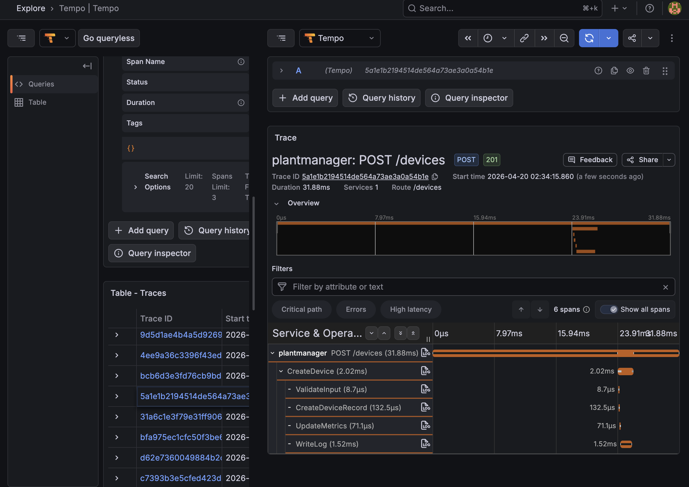
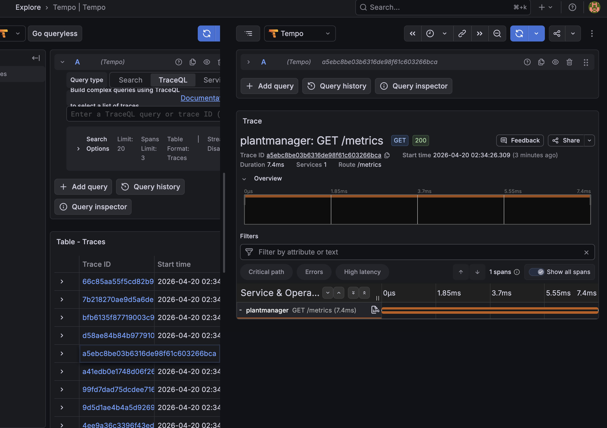
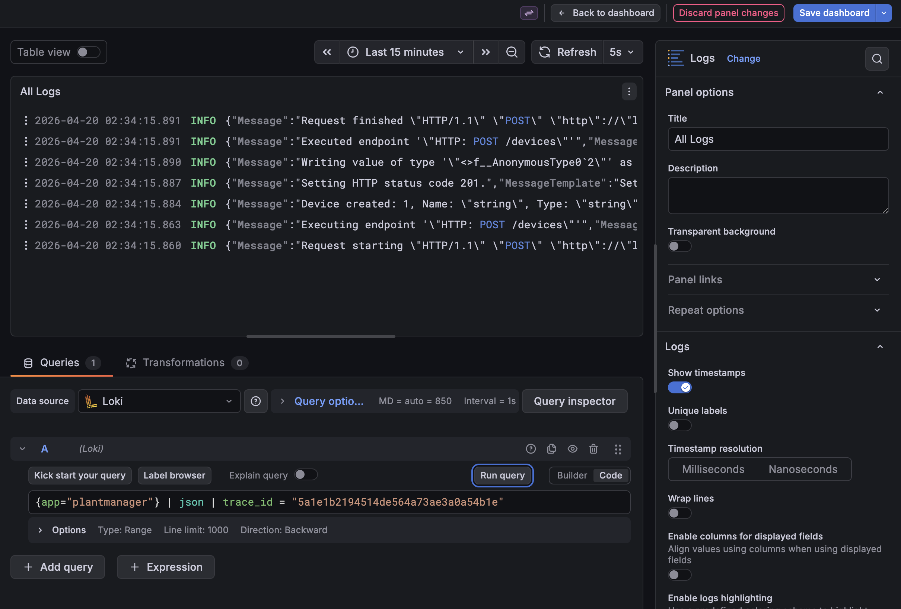

## Л/Р 5. Экспорт трейсов

Приложение собирает трейсы при помощи **OpenTelemetry** → **Tempo** и визуализирует их в **Grafana**.

### Архитектура трейсинга

```
PlantManager (OpenTelemetry SDK)
    ↓
Tempo (хранение трейсов)
    ↓
Grafana (визуализация + запросы)
```

Логи автоматически обогащаются `trace_id` и `span_id` при попощи класса TraceEnricher.

### Примеры

Трейс создания датчика с несколькими спанами


Трейс эндпоинта метрик с одним спаном


Поиск логов по трейсу

